 Project Context: Balatro 🃏

## Current Modules
- build_dataset: capture screenshots
- annotate_dataset: labeling UI
- augment_dataset: data augmentation 
- train_model: AI training (Finished)
- identify_card: real-time inference 
- utils: shared helpers
- config: Global configuration

## Dataset Stats
- Labeled: 417
- Unlabeled: 0
- Total: 417
- Unique Cards:
  - Joker: 122
  - Planet: 10
  - Tarot: 22
  - Spectral: 16

## Notes
- Using Streamlit for UI
- Folder structure follows:
  Balatro/
  ├── config/
  ├── annotate_dataset/
  ├── augment_dataset/
  ├── build_dataset/
  ├── train_model/
  ├── identify_card/
  ├── data/
  └── utils/
- Screenshots folders is gitignored

## Next Steps / Ideas

## Next Improvements / Roadmap

- **Add full path to images in JSON in annotate module**
- **Correct path to cards instead of unlabeled**
- **Make semi-automatic annotate cards**
- **Implement the identify card**
- **Fine tune the model**

---

# 🎨 High-Level Pipeline - Balatro

```mermaid
flowchart TD
    A[📸 Capture Screenshots<br/>from Real Gameplay] --> B[🗂 Organize & Annotate Dataset<br/>annotate_dataset]
    B --> C[🎨 Data Augmentation<br/>Generate synthetic variations]
    C --> D[🧠 Embedding Model / Feature Extraction<br/>Pretrained CNN or ViT]
    D --> E[🔍 Similarity Search / k-NN<br/>Match new card embeddings to reference set]
    E --> F[🏷 Assign Card Name, Type, Rarity, Modifier]
    F --> G[💾 Save Labeled Dataset]
    G --> H[🚀 Train Final Model<br/>Optional classifier or fine-tuned model]
    H --> I[🔎 Inference / Real-Time Recognition]
```

---
## 📝 Design Decisions & Problems

### Problems Encountered

1. **Dataset Strategy**

   * Mixing original and augmented data directly risked leaking augmented samples into validation.
   * Needed flexible handling of augmentation (e.g., modifiers vs. identification).

2. **Task Separation**

   * Initially considered training separate models for each task (identification, modifier).
   * This was inefficient and duplicated effort.

3. **Training State Persistence**

   * Deciding how to persist heads, class names, and optimizer/scheduler/scaler consistently.
   * Avoiding missing keys when reloading for inference.

### Final Decisions

* **Unified Model**

  * One shared backbone model with multiple task-specific heads.
  * Example heads:

    * *Identification* → Joker card identity.
    * *Modifier* → Negative modifier (others later).

* **Shared Training Components**

  * Optimizer, scheduler, and scaler are shared across all heads (since it’s one model).
  * Each head maintains its own `class_names` and state for persistence.

* **Dataset Handling**

  * No strict "Split → Augment" pipeline.
  * Each head may define its own dataset strategy (augmented or not).
  * This allows modifier detection to use synthetic negatives, while identification may use broader augmentations.

* **Extensibility**

  * Adding a new task = add a new head + dataset strategy.
  * Backbone and training loop stay the same.
  * Makes the system modular and future-proof (holographic, foil, etc.).

---

✅ This design avoids data leakage, reduces duplication, and supports multi-task learning in a clean, extensible way.
