 Project Context: Balatro 🃏

## Current Modules
- build_dataset: capture screenshots
- annotate_dataset: labeling UI
- augment_dataset: data augmentation 
- models: shared models
- train_model: AI training 
- utils: shared helpers
- config: Global configuration

## Dataset Stats
- Labeled: 1387
- Unlabeled: 0
- Total: 1387
- Unique Cards:
  - Joker: 133
  - Planet: 10
  - Tarot: 22
  - Spectral: 16
- Unique cards per modifier:
  - Base: 177
  - Foil: 90
  - Holographic: 43
  - Polychrome: 58
  - Negative: 39

## Notes
- Using Streamlit for UI
- Folder structure follows:
  Balatro/
  ├── config/
  ├── annotate_dataset/
  ├── augment_dataset/
  ├── build_dataset/
  ├── train_model/
  ├── identify_card/
  ├── data/
  └── utils/
- Screenshots folders is gitignored

## Next Steps / Ideas

## Next Improvements / Roadmap

- **Add full path to images in JSON in annotate module**
- **Correct path to cards instead of unlabeled**
- **Make semi-automatic annotate cards**
- **Implement the identify card**
- **Fine tune the model**


---

# 🎨 High-Level Pipeline - Balatro

```mermaid
flowchart TD
    A[📸 Capture Screenshots<br/>from Real Gameplay] --> B[🗂 Organize & Annotate Dataset<br/>annotate_dataset]
    B --> C[🎨 Data Augmentation<br/>Generate synthetic variations]
    C --> D[🧠 Embedding Model / Feature Extraction<br/>Pretrained CNN or ViT]
    D --> E[🔍 Similarity Search / k-NN<br/>Match new card embeddings to reference set]
    E --> F[🏷 Assign Card Name, Type, Rarity, Modifier]
    F --> G[💾 Save Labeled Dataset]
    G --> H[🚀 Train Final Model<br/>Optional classifier or fine-tuned model]
    H --> I[🔎 Inference / Real-Time Recognition]
```



---
## 📝 Design Decisions & Problems

### Problems Encountered

1. **Dataset Strategy**

   * Mixing original and augmented data directly risked leaking augmented samples into validation.
   * Needed flexible handling of augmentation (e.g., modifiers vs. identification).

2. **Task Separation**

   * Initially considered training separate models for each task (identification, modifier).
   * This was inefficient and duplicated effort.

3. **Training State Persistence**

   * Deciding how to persist heads, class names, and optimizer/scheduler/scaler consistently.
   * Avoiding missing keys when reloading for inference.

### Final Decisions

* **Unified Model**

  * One shared backbone model with multiple task-specific heads.
  * Example heads:

    * *Identification* → Joker card identity.
    * *Modifier* → Negative modifier (others later).

* **Shared Training Components**

  * Optimizer, scheduler, and scaler are shared across all heads (since it’s one model).
  * Each head maintains its own `class_names` and state for persistence.

* **Dataset Handling**

  * No strict "Split → Augment" pipeline.
  * Each head may define its own dataset strategy (augmented or not).
  * This allows modifier detection to use synthetic negatives, while identification may use broader augmentations.

* **Extensibility**

  * Adding a new task = add a new head + dataset strategy.
  * Backbone and training loop stay the same.
  * Makes the system modular and future-proof (holographic, foil, etc.).

---

✅ This design avoids data leakage, reduces duplication, and supports multi-task learning in a clean, extensible way.


# 🧩 Model Training Next Steps

## Overview

You trained a multi-head model with two classification heads:

* **Card head (180 classes):** improving but limited by frozen backbone.
* **Modifier head (5 classes):** near-perfect overall, but the *Negative* class still lags.

The next steps focus on improving both heads by progressively fine-tuning the backbone, improving balance, and refining augmentations.

---

## 🔧 Step 1: Unfreeze Backbone (Partial Fine-Tuning)

**Goal:** Allow the model to learn fine-grained features for both card and modifier heads.

* Unfreeze the **last 2–3 layers** of the backbone (e.g., `layer3`, `layer4` in ResNet, or final blocks in ConvNeXt/ViT).
* Use **differential learning rates:**

  ```python
  optimizer = AdamW([
      {'params': backbone.parameters(), 'lr': 1e-5},
      {'params': heads.parameters(), 'lr': 1e-4}
  ])
  ```
* Keep the rest of the backbone frozen initially.
* Add a scheduler such as:

  ```python
  scheduler = torch.optim.lr_scheduler.CosineAnnealingLR(optimizer, T_max=50)
  ```

---

## ⏱️ Step 2: Extend Training Duration

* Continue training up to **50–70 epochs total**.
* Enable **EarlyStopping(patience=10)** to stop automatically if validation loss plateaus.
* Keep monitoring Top-3 accuracy and confusion matrices.

---

## ⚖️ Step 3: Balance the Modifier Head (Focus on "Negative")

**Issue:** The "Negative" class remains underperforming.

### Actions:

* Add **class weights** in the modifier loss:

  ```python
  weights = torch.tensor([1.0, 1.0, 1.0, 1.0, 3.0]).to(device)
  criterion_modifier = CrossEntropyLoss(weight=weights)
  ```

  Adjust based on real class frequencies.

* Optionally, **oversample** underrepresented classes with `WeightedRandomSampler`.

* Reduce or remove strong **color-based augmentations** (e.g. `ColorJitter`, `Hue`, heavy brightness changes) since the Negative/Positive distinction is color-dependent.

---

## 🎯 Step 4: Optional Modifier Head Freeze

Once the modifier head stabilizes (~99% accuracy across all classes):

```python
for p in modifier_head.parameters():
    p.requires_grad = False
```

This focuses learning on improving the card head without disturbing the already good modifier classifier.

---

## 🧠 Step 5: Monitor & Evaluate

Track during fine-tuning:

* `val_card_top3_acc` → should steadily rise beyond 85–90%.
* `val_modifier_confusion` → "Negative" diagonal entries should approach parity with others.
* Watch for overfitting signs in val loss.

---

## ✅ Summary Table

| Step | Action                          | Purpose                      |
| ---- | ------------------------------- | ---------------------------- |
| 1    | Unfreeze last 2–3 layers        | Learn finer visual cues      |
| 2    | Train 50–70 epochs              | Stabilize long-term learning |
| 3    | Weighted loss + oversampling    | Fix modifier imbalance       |
| 4    | Lighten color augmentations     | Preserve color polarity      |
| 5    | Freeze modifier head (optional) | Focus compute on card head   |

---

**Next session:**
We can refine this README with actual class counts, backbone-specific unfreeze code, and augmentation inspection once you reopen the session.
