 Project Context: Balatro 🃏

## Current Modules
- build_dataset: capture screenshots
- annotate_dataset: labeling UI
- augment_dataset: data augmentation 
- train_model: AI training (Finished)
- identify_card: real-time inference 
- utils: shared helpers
- config: Global configuration

## Dataset Stats
- Labeled: 417
- Unlabeled: 0
- Total: 417
- Unique Cards:
  - Joker: 122
  - Planet: 10
  - Tarot: 22
  - Spectral: 16

## Notes
- Using Streamlit for UI
- Folder structure follows:
  Balatro/
  ├── config/
  ├── annotate_dataset/
  ├── augment_dataset/
  ├── build_dataset/
  ├── train_model/
  ├── identify_card/
  ├── data/
  └── utils/
- Screenshots folders is gitignored

## Next Steps / Ideas

## Next Improvements / Roadmap

- **Add full path to images in JSON in annotate module**
- **Correct path to cards instead of unlabeled**
- **Make semi-automatic annotate cards**
- **Implement the identify card**
- **Fine tune the model**


---

# 🎨 High-Level Pipeline - Balatro

```mermaid
flowchart TD
    A[📸 Capture Screenshots<br/>from Real Gameplay] --> B[🗂 Organize & Annotate Dataset<br/>annotate_dataset]
    B --> C[🎨 Data Augmentation<br/>Generate synthetic variations]
    C --> D[🧠 Embedding Model / Feature Extraction<br/>Pretrained CNN or ViT]
    D --> E[🔍 Similarity Search / k-NN<br/>Match new card embeddings to reference set]
    E --> F[🏷 Assign Card Name, Type, Rarity, Modifier]
    F --> G[💾 Save Labeled Dataset]
    G --> H[🚀 Train Final Model<br/>Optional classifier or fine-tuned model]
    H --> I[🔎 Inference / Real-Time Recognition]
```



---
# 📝 Project Decisions - Balatro

## A. How to Build the Dataset

### Options:

1. **Use game images directly**
   **Advantages:**

   * Easy to collect all cards
     **Constraints:**
   * Not realistic game scenario
   * AI may learn visual aspects of the game interface rather than the card itself

2. **Take screenshots from the game’s collection**
   **Advantages:**

   * Easy to have each unique card
     **Constraints:**
   * Still not a real scenario
   * Slight rotations or differences in card presentation can cause issues

3. **Take screenshots from real gameplay scenario**
   **Advantages:**

   * More realistic training data
   * Better learning experience for AI
   * Provides natural variations in cards (rotation, lighting, perspective)
     **Constraints:**
   * Requires some automation to capture screenshots
   * No guarantee to capture all unique cards in one session

**✅ Chosen Strategy:**
Take screenshots from real gameplay (Option 3).

---

## B. Not Enough Images Per Unique Card

### Options:

1. **Few-shot / Transfer Learning**

   * Use pretrained vision models (ResNet, EfficientNet, ViT)
     **Advantages:** Easier setup
     **Constraints:** May be less accurate when sample size is extremely low

2. **Feature Extraction + Similarity Search**

   * Train (or use pretrained) model to produce embeddings of card images
   * Store embeddings of labeled reference cards
   * For a new card, compute embedding and use cosine similarity or k-NN to find closest match
     **Advantages:** Efficient identification of new cards, works well with very few samples per card
     **Constraints:** Requires additional code to compute and compare embeddings

3. **Augmentation-heavy Training**

   * Generate multiple synthetic variations of each card (rotation, crop, color, noise, etc.)
     **Advantages:** Quickly expands dataset without manual labeling, provides variety for training
     **Constraints:** Variations are artificial; may not perfectly mimic real-world conditions

4. **Progressive Approach**

   * Start with a subset (e.g., 10 Jokers + 5 Tarots) and gradually expand pipeline
     **Advantages:** Allows development and testing without waiting for full dataset
     **Constraints:** Not production-ready; only suitable for iterative experimentation

**✅ Chosen Strategy:**
Combine **augmentation** + **embedding-based similarity search**.

---

## C. Splitting Strategy (Train vs. Validation)

### Context

* Unlike standard classification tasks (“cat vs dog”), here each **class = identity of a unique card**.
* Goal is not to generalize to new concepts but to **memorize and robustly recognize each specific card** under small variations (rotation, blur, lighting, etc.).
* With modifiers, some augmentation strategies (e.g., Negative filter) need to be applied carefully so that the model sees all modifier types.

### Options

1. **Augment → Split**

   * Apply offline augmentations to the full labeled dataset, then randomly split into train/validation.
     **Advantages:**

     * Ensures every card identity appears in both sets
     * Validation checks robustness to augmentation noise (practical for deployment)
       **Constraints:**
     * Overestimates “generalization,” since validation sees the same card identities
     * Not ideal for rare or synthetic modifiers

2. **Split → Augment**

   * Split original labeled images into train/validation **before** applying augmentation.
     **Advantages:**

     * Allows validation to evaluate performance on unseen augmentations
     * Useful for modifier recognition tasks
       **Constraints:**
     * With very few samples per card, some classes may disappear entirely from train or validation
     * Less useful for base card memorization

3. **Hybrid Strategy**

   * **Base card recognition:** Augment → Split (as before)
   * **Modifier recognition:** Apply Split → Augment for synthetic modifiers
     **Advantages:**

     * Preserves base card memorization while allowing modifier detection
       **Constraints:**
     * Requires code to handle different splits/augmentations per task

**✅ Chosen Strategy:**
Use a **hybrid strategy**:

* Base card identity: **Augment → Split**
* Modifier detection (especially Negative filter): **Split → Augment**
* Validation metrics should focus on **per-class accuracy** for base cards and per-modifier accuracy for modifiers.

---

## D. Detecting Card Modifiers

### Context

* Each card can have a **modifier** affecting its appearance:

```python
MODIFIER_OPTIONS = ["Base", "Foil", "Holographic", "Polychrome", "Negative"]
```

* Modifiers are similar to filters or effects applied to the card.
* Goal: the model should **recognize both the card identity and its modifier**.
* Challenge: some modifiers (Foil, Holographic, Polychrome) are difficult to reproduce artificially, may be animated, and only snapshots are available.
* The **Negative** modifier is easier to simulate (invert colors) and is of primary interest.

### Options

1. **Treat modifiers as separate classes**

   * Example: “Joker_Base”, “Joker_Negative”, etc.
     **Advantages:** Simple to implement in classification pipeline
     **Constraints:** Number of classes grows combinatorially (card × modifier); rare modifiers may have too few samples

2. **Multi-task learning**

   * One head predicts **card identity**, another predicts **modifier type**
     **Advantages:** Each head can focus on its specific task; modifier head can generalize across card identities
     **Constraints:** Requires more complex model architecture; synthetic augmentations may still be needed for rare modifiers

3. **Focus on easily-reproducible modifiers first**

   * Prioritize **Negative** modifier detection
   * Other modifiers collected progressively as real examples
     **Advantages:** Guarantees meaningful modifier detection task
     **Constraints:** Other modifiers remain “optional” until enough real data is collected

**✅ Chosen Strategy:**

* Use **multi-task model**:

  * **Primary head:** card identity
  * **Secondary head:** modifier detection
* Focus on **Negative modifier** for synthetic augmentation
* Collect other modifier examples progressively for future training
* This allows the model to **generalize modifier detection** while reliably recognizing card identities.

### Implications for Training

* **Card identity head (first head)**

  * Uses full dataset with offline augmentations, including synthetic Negative images.
  * Follows **Augment → Split** strategy.
* **Modifier head (second head)**

  * Uses original card images only, no offline augmentation for rare modifiers.
  * Follows **Split → Augment** strategy.
* Validation metrics:

  * **Card identity:** per-class accuracy
  * **Modifier detection:** per-modifier accuracy, with focus on Negative modifier

---

## E. Two-Head Model Strategy

### Context

* The model has **two outputs (heads)**:

  1. Card identity head – predicts the specific card
  2. Modifier head – predicts the card modifier
* Each head uses a different data and augmentation strategy.

### 1️⃣ Card Identity Head (First Head)

* **Goal:** Robustly recognize each card regardless of minor variations.
* **Dataset:** Full card dataset with offline augmentations.
* **Augmentation:** Standard transforms + synthetic Negative augmentations.
* **Split strategy:** **Augment → Split** to ensure all cards appear in train/validation sets.

### 2️⃣ Modifier Head (Second Head)

* **Goal:** Detect modifier type, focusing on Negative.
* **Dataset:** Original images (no offline augmentations for rare modifiers).
* **Augmentation:** Only realistic augmentations; avoid excessive synthetic negatives.
* **Split strategy:** **Split → Augment** to evaluate modifier detection on unseen cards.

### Key Considerations

1. **Head separation allows specialization**
2. **Negative modifier handling**
3. **Training & evaluation metrics**

✅ **Outcome:** Two-head architecture robustly recognizes card identity and modifiers with appropriate augmentation and split strategies.
