 Project Context: Balatro 🃏

## Current Modules
- build_dataset: capture screenshots
- annotate_dataset: labeling UI
- augment_dataset: data augmentation 
- train_model: AI training 
- identify_card: real-time inference (planned)
- utils: shared helpers
- config: Global configuration

## Dataset Stats
- Labeled: 417
- Unlabeled: 0
- Total: 417
- Unique Cards:
  - Joker: 122
  - Planet: 10
  - Tarot: 22
  - Spectral: 16

## Notes
- Using Streamlit for UI
- Folder structure follows:
  Balatro/
  ├── config/
  ├── annotate_dataset/
  ├── augment_dataset/
  ├── build_dataset/
  ├── train_model/
  ├── identify_card/
  ├── data/
  └── utils/
- Screenshots folders is gitignored

## Next Steps / Ideas
- Implement the identify card
- Test on a small subset
- Fine tune the model

# 📝 Project Decisions - Balatro

## A. How to Build the Dataset

### Options:

1. **Use game images directly**  
   **Advantages:**  
   - Easy to collect all cards  
   **Constraints:**  
   - Not realistic game scenario  
   - AI may learn visual aspects of the game interface rather than the card itself  

2. **Take screenshots from the game’s collection**  
   **Advantages:**  
   - Easy to have each unique card  
   **Constraints:**  
   - Still not a real scenario  
   - Slight rotations or differences in card presentation can cause issues  

3. **Take screenshots from real gameplay scenario**  
   **Advantages:**  
   - More realistic training data  
   - Better learning experience for AI  
   - Provides natural variations in cards (rotation, lighting, perspective)  
   **Constraints:**  
   - Requires some automation to capture screenshots  
   - No guarantee to capture all unique cards in one session  

**✅ Chosen Strategy:**  
Take screenshots from real gameplay (Option 3).

---

## B. Not Enough Images Per Unique Card

### Options:

1. **Few-shot / Transfer Learning**  
   - Use pretrained vision models (ResNet, EfficientNet, ViT)  
   **Advantages:**  
   - Easier setup  
   **Constraints:**  
   - May be less accurate when sample size is extremely low  

2. **Feature Extraction + Similarity Search**  
   - Train (or use pretrained) model to produce embeddings of card images  
   - Store embeddings of labeled reference cards  
   - For a new card, compute embedding and use cosine similarity or k-NN to find closest match  
   **Advantages:**  
   - Efficient identification of new cards  
   - Works well with very few samples per card  
   **Constraints:**  
   - Requires additional code to compute and compare embeddings  

3. **Augmentation-heavy Training**  
   - Generate multiple synthetic variations of each card (rotation, crop, color, noise, etc.)  
   **Advantages:**  
   - Quickly expands dataset without manual labeling  
   - Provides variety for training  
   **Constraints:**  
   - Variations are artificial; may not perfectly mimic real-world conditions  

4. **Progressive Approach**  
   - Start with a subset (e.g., 10 Jokers + 5 Tarots) and gradually expand pipeline  
   **Advantages:**  
   - Allows development and testing without waiting for full dataset  
   **Constraints:**  
   - Not production-ready; only suitable for iterative experimentation  

**✅ Chosen Strategy:**  
Combine **augmentation** + **embedding-based similarity search**.  
- Provides strong performance with minimal manual labeling effort  
- Balances real variations with AI recognition efficiency

# 🎨 High-Level Pipeline - Balatro

```mermaid
flowchart TD
    A[📸 Capture Screenshots<br/>from Real Gameplay] --> B[🗂 Organize & Annotate Dataset<br/>annotate_dataset]
    B --> C[🎨 Data Augmentation<br/>Generate synthetic variations]
    C --> D[🧠 Embedding Model / Feature Extraction<br/>Pretrained CNN or ViT]
    D --> E[🔍 Similarity Search / k-NN<br/>Match new card embeddings to reference set]
    E --> F[🏷 Assign Card Name, Type, Rarity, Modifier]
    F --> G[💾 Save Labeled Dataset]
    G --> H[🚀 Train Final Model<br/>Optional classifier or fine-tuned model]
    H --> I[🔎 Inference / Real-Time Recognition]
```

